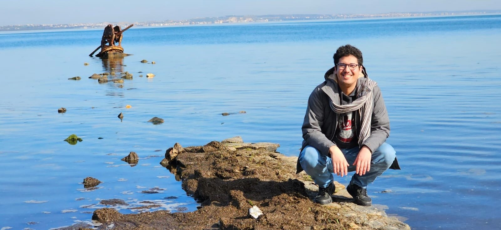

<h1 align="center">Hi 👋, I'm Aymen Mahmoudi</h1>

<h3 align="center">PhD student in C2N lab (University of Paris-Saclay)</h3>

- 🔭 My research focuses on 2D materials, where I am investigating their optical and electronic properties
  
-  👨‍💻 All of my projects are available through GitHub/GitLab platforms. I try to build GUI apps to create tools used by the community of physicists that I hope will be useful or at least helpful for those who want to start developing new tools. 
  
- 🌱  I’m currently learning machine learning and deepening my skills in data science

- 🤝 I’m looking to collaborate on any project combining physics and data science

- 💬 Ask me about: The photoemission technique, spectroscopy techniques, Python, PyQT, git, HTML/CSS, IgorPro, and Matlab

- 📫 **<a href="https://aymen-mahmoudi.fr/" target="_blank">aymen-mahmoudi.fr</a>**

<h3 align="left">Languages and Tools:</h3>

 
